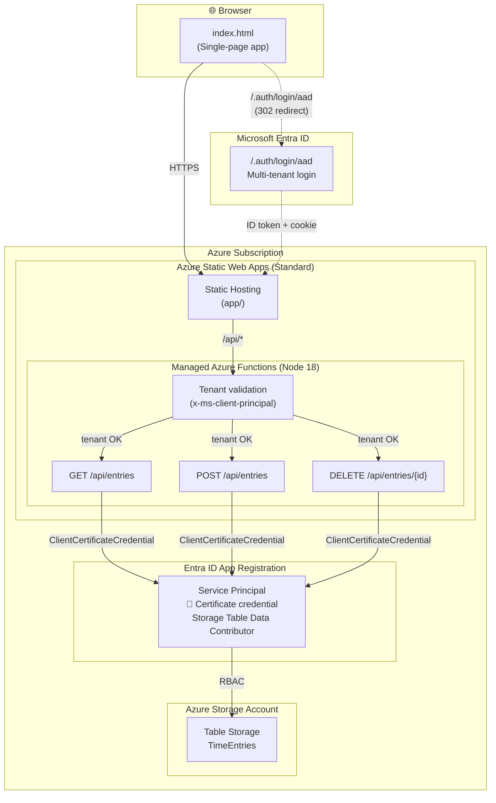

# Time Entry Demo

A lightweight time-tracking web app built on Azure Static Web Apps with Azure Table Storage for persistence and Azure AD authentication.


## What You Get

- **Single-page time entry UI** — date, project, task, hours, billable flag, notes
- **Persistent storage** — Azure Table Storage (no SQL database needed)
- **Azure AD authentication** — built-in provider with API-level tenant validation
- **Serverless API** — Azure Functions (managed by Static Web Apps)
- **Zero infrastructure to manage** — all serverless, minimal cost

## Architecture



### How it works

| Layer | Details |
|-------|---------|
| **Front-end** | Single HTML file served by SWA's global CDN. No build step. |
| **Authentication** | SWA's built-in Azure AD provider (`/.auth/login/aad`). No app registration or client secret needed — Microsoft manages it. Any Azure AD user can log in. |
| **Tenant validation** | Each API function checks the `x-ms-client-principal` header for a matching tenant ID. Users from other tenants get a 403. Combined with your org's Conditional Access policies (e.g., MFA), this provides strong access control. |
| **API** | Three Azure Functions (managed by SWA, Node 18). Routed automatically via `/api/*`. |
| **Storage auth** | A service principal with the **Storage Table Data Contributor** RBAC role authenticates via `ClientCertificateCredential`. The deploy script generates a self-signed certificate — no password credentials needed (compliant with enterprise Entra policies). |
| **Data** | Azure Table Storage — schema-less, pay-per-use, no database server to manage. |

## Prerequisites

| Tool | Minimum Version | Install |
|------|----------------|---------|
| **PowerShell** | 7+ | Built into Windows 11, or [install](https://learn.microsoft.com/en-us/powershell/scripting/install/installing-powershell) |
| **Azure CLI** | 2.50+ | `winget install Microsoft.AzureCLI` |
| **Node.js** | 18+ | `winget install OpenJS.NodeJS.LTS` |

You also need:
- An Azure subscription
- An Entra ID user account (app registration permissions are NOT required)

## Quick Start

```powershell
# 1. Clone this repo
git clone https://github.com/YOUR_USERNAME/time-entry-demo.git
cd time-entry-demo

# 2. Log in to Azure (if not already)
az login

# 3. Deploy everything
./deploy.ps1
```

That's it. The script will:
1. Create a resource group, storage account, and Static Web App (Standard tier)
2. Create a service principal with a certificate credential for Table Storage access
3. Generate the SWA config with built-in AAD auth routes
4. Configure all app settings and deploy the app + API

At the end it prints the URL to open in your browser.

## Options

```powershell
# Deploy with a custom prefix (affects resource names)
./deploy.ps1 -Prefix myteam

# Deploy to a different region
./deploy.ps1 -Location westus2

# Deploy without Entra ID auth (open to anyone)
./deploy.ps1 -SkipAuth

# Tear down everything
./deploy.ps1 -Teardown
./deploy.ps1 -Prefix myteam -Teardown   # if you used a custom prefix
```

## Project Structure

```
time-entry-demo/
├── deploy.ps1                    # One-click deployment script
├── app/
│   ├── index.html                # Single-file front-end (HTML + CSS + JS)
│   └── staticwebapp.config.json  # Generated by deploy.ps1
└── api/
    ├── host.json                 # Azure Functions host config
    ├── package.json              # Node.js dependencies
    ├── getEntries/               # GET /api/entries
    │   ├── function.json
    │   └── index.js
    ├── saveEntry/                # POST /api/entries
    │   ├── function.json
    │   └── index.js
    └── deleteEntry/              # DELETE /api/entries/{id}
        ├── function.json
        └── index.js
```

## Cost

| Resource | Tier | Approximate cost |
|----------|------|------------------|
| **Static Web Apps** | Standard | ~$9/month |
| **Azure Table Storage** | Standard LRS | ~$0.045/GB/month (pennies for demo usage) |
| **Azure Functions** | Managed by SWA | Included with SWA tier |

The deploy script creates a **Standard** tier SWA (~$9/month). Standard is required in environments with restrictive Entra ID policies and also enables features like custom domains and higher bandwidth limits.

> **Note on managed identity:** Standard tier enables managed identity on the SWA resource, but SWA managed functions **cannot** use it at runtime (`IDENTITY_HEADER` is not exposed to function code). The API uses a service principal instead. A linked Azure Functions app would be needed for full MI support.

## Troubleshooting

### "Too many redirects" after deploying
The `/.auth/*` route must appear **before** the `/*` catch-all in `staticwebapp.config.json`. Without it, unauthenticated requests to `/.auth/login/aad` match the `/*` rule (which requires `authenticated`), triggering a 302 back to `/.auth/login/aad` — an infinite loop. The deploy script handles this automatically.

### "Could not load entries" or API returns 500
| Cause | Fix |
|-------|-----|
| **Storage account has public access disabled** | Enable public network access. SWA managed functions don't support private endpoints on storage. |
| **TimeEntries table doesn't exist** | Re-run `deploy.ps1` — it creates the table via ARM at deploy time. |
| **Missing app settings** | Check `AZURE_TENANT_ID`, `AZURE_CLIENT_ID`, `AZURE_CLIENT_CERTIFICATE`, and `TABLE_STORAGE_URL` are set on the SWA. |
| **Service principal certificate expired** | Re-run `deploy.ps1` — it generates a fresh 1-year certificate. |

### Checking API logs
```powershell
# Stream live logs from the SWA
az staticwebapp functions show --name timeentry-demo --resource-group rg-timeentry-demo
```

## Security Notes

- **Built-in AAD authentication**: Uses SWA's built-in Azure AD provider (`/.auth/login/aad`). No app registration or client secret is needed for login — Microsoft manages the identity provider entirely. This avoids enterprise Entra policies that block password credentials on app registrations.
- **API-level tenant validation**: The built-in AAD provider is multi-tenant (any Azure AD user can log in). To restrict access, every API function validates the tenant ID from the `x-ms-client-principal` header against `AZURE_TENANT_ID`. Users from other tenants receive a 403. Combined with your org's tenant-wide Conditional Access policies (MFA, device compliance, etc.), this provides defense in depth.
- **Certificate-based storage auth**: The API uses `ClientCertificateCredential` with a deploy-time generated self-signed certificate (1-year expiry). The PEM is stored as a base64-encoded app setting (encrypted at rest). No password credentials are created.
- **Why not managed identity?** SWA managed functions do not expose `IDENTITY_HEADER` or the MSI endpoint to user code. `DefaultAzureCredential` fails entirely. This is a [known platform limitation](https://learn.microsoft.com/en-us/azure/static-web-apps/apis-functions).
- **Storage network access**: The storage account uses public network access. To fully lock it down, you'd need to replace SWA managed functions with a linked Azure Functions app that supports VNet integration and private endpoints.

## Cleanup

To remove all Azure resources:

```powershell
./deploy.ps1 -Teardown
```

This deletes the resource group (and everything in it) plus the API service principal app registration.
