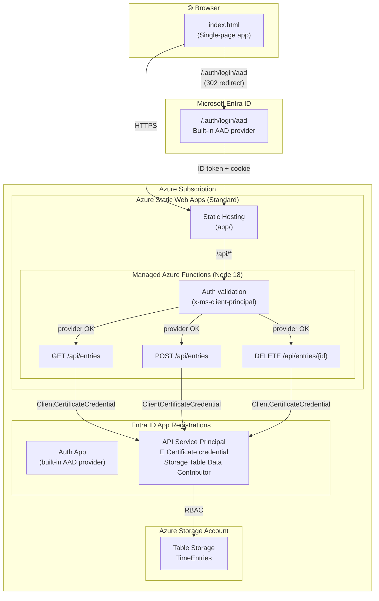

# Time Entry Demo

A lightweight time-tracking web app built on Azure Static Web Apps with Azure Table Storage for persistence and Entra ID for authentication.


## What You Get

- **Single-page time entry UI** — date, project, task, hours, billable flag, notes
- **Persistent storage** — Azure Table Storage (no SQL database needed)
- **Azure AD authentication** — built-in AAD provider with single-tenant Entra ID
- **Serverless API** — Azure Functions (Flex Consumption, linked to SWA)
- **Enterprise-ready networking** — VNet + private endpoints (no public storage access)
- **Zero infrastructure to manage** — all serverless, minimal cost


## Architecture



### How it works

| Layer | Details |
|-------|---------|
| **Front-end** | Single HTML file served by SWA's global CDN. No build step. |
| **Authentication** | Single-tenant Entra ID app registration using the built-in AAD provider. No client secret required — SWA handles token exchange internally. This avoids issues with enterprise Entra policies that block password credentials. Optional claims are configured to ensure SWA can identify the user. |
| **Auth validation** | Each API function checks the `x-ms-client-principal` header to confirm the user authenticated via the built-in AAD provider (`identityProvider === "aad"`). Since the provider is configured with a single-tenant issuer URL, only users from the expected tenant can obtain a valid session. |
| **API** | Three Azure Functions on a Flex Consumption plan with VNet integration. Linked to SWA as a backend — SWA forwards `/api/*` requests and the `x-ms-client-principal` auth header. |
| **Storage auth** | A service principal with the **Storage Table Data Contributor** RBAC role authenticates via `ClientCertificateCredential`. The deploy script generates a self-signed certificate — no password credentials needed (compliant with enterprise Entra policies). |
| **Networking** | A VNet with two subnets: one for Functions VNet integration (outbound), one for private endpoints. Storage has public network access **disabled**. The Functions app reaches storage exclusively through private endpoints + private DNS zones. |
| **Data** | Azure Table Storage — schema-less, pay-per-use, no database server to manage. |

## Prerequisites

| Tool | Minimum Version | Install |
|------|----------------|---------|
| **Windows** | 10 or 11 | Required (uses `New-SelfSignedCertificate` for cert generation) |
| **PowerShell** | 7+ | Built into Windows 11, or [install](https://learn.microsoft.com/en-us/powershell/scripting/install/installing-powershell) |
| **Azure CLI** | 2.50+ | `winget install Microsoft.AzureCLI` |
| **Node.js** | 18+ | `winget install OpenJS.NodeJS.LTS` |

You also need:
- An Azure subscription
- Permissions to create app registrations in your Entra ID tenant

## Quick Start

```powershell
# 1. Clone this repo
git clone https://github.com/t3blake/time-track-demo.git
cd time-track-demo

# 2. Log in to Azure (if not already)
az login

# 3. Deploy everything (you'll be prompted for a unique prefix)
./deploy.ps1
```

The script prompts for a **prefix** (e.g. your alias) to generate unique Azure resource names. Then it will:
1. Create a resource group, VNet, and storage account with private endpoints
2. Create a service principal with a certificate credential for Table Storage access
3. Create a Flex Consumption Functions app with VNet integration
4. Create a Static Web App (Standard) and link the Functions app as its backend
5. Register an Entra ID auth app with API permissions and optional claims
6. Generate the SWA config and deploy static content

At the end it prints the URL to open in your browser.

## Options

```powershell
# Skip the prefix prompt by passing it directly
./deploy.ps1 -Prefix jsmith

# Deploy to a different region
./deploy.ps1 -Prefix jsmith -Location westus2

# Deploy without Entra ID auth (open to anyone)
./deploy.ps1 -Prefix jsmith -SkipAuth

# Tear down everything
./deploy.ps1 -Prefix jsmith -Teardown
```

## Project Structure

```
time-entry-demo/
├── deploy.ps1                    # One-click deployment script
├── app/
│   ├── index.html                # Single-file front-end (HTML + CSS + JS)
│   └── staticwebapp.config.json  # Generated by deploy.ps1
└── api/
    ├── host.json                 # Azure Functions host config
    ├── package.json              # Node.js dependencies
    ├── getEntries/               # GET /api/entries
    │   ├── function.json
    │   └── index.js
    ├── saveEntry/                # POST /api/entries
    │   ├── function.json
    │   └── index.js
    └── deleteEntry/              # DELETE /api/entries/{id}
        ├── function.json
        └── index.js
```

## Cost

| Resource | Tier | Approximate cost |
|----------|------|------------------|
| **Static Web Apps** | Standard | ~$9/month |
| **Azure Functions** | Flex Consumption | ~$0 for demo traffic (pay-per-execution) |
| **Azure Table Storage** | Standard LRS | ~$0.045/GB/month (pennies for demo usage) |
| **VNet + Private Endpoints** | Standard | ~$7/month (3 PEs × ~$2.30 each) |
| **Private DNS Zones** | Standard | ~$0.75/month (3 zones × $0.25 each) |

Total: **~$17/month** for a fully enterprise-compliant deployment with no public storage access.

> **Note on managed identity:** The Functions app could use managed identity for storage access, but a service principal with certificate credential is used instead for consistency with enterprise Entra policies and to keep the deployment script self-contained.

## Troubleshooting

### "Too many redirects" after deploying
The `/.auth/*` route must appear **before** the `/*` catch-all in `staticwebapp.config.json`. Without it, unauthenticated requests to `/.auth/login/aad` match the `/*` rule (which requires `authenticated`), triggering a 302 back to `/.auth/login/aad` — an infinite loop. The deploy script handles this automatically.

### "Could not load entries" or API returns 500
| Cause | Fix |
|-------|-----|
| **Functions app not linked to SWA** | Check `az staticwebapp backends list`. Re-run `deploy.ps1` to re-link. |
| **Private endpoint DNS not resolving** | Verify the private DNS zones exist and are linked to the VNet. Re-run `deploy.ps1`. |
| **TimeEntries table doesn't exist** | Re-run `deploy.ps1` — it creates the table via ARM at deploy time. |
| **Missing app settings on Functions app** | Check `AZURE_TENANT_ID`, `AZURE_CLIENT_ID`, `AZURE_CLIENT_CERTIFICATE`, `TABLE_STORAGE_URL` on the Functions app, and `AAD_CLIENT_ID` on the SWA. |
| **Service principal certificate expired** | Re-run `deploy.ps1` — it generates a fresh 1-year certificate. |

### Checking API logs
```powershell
# Stream live logs from the Functions app
az functionapp log tail --name <prefix>-demo-api --resource-group rg-<prefix>-demo
```

## Security Notes

- **Built-in AAD provider**: Uses the SWA built-in `azureActiveDirectory` identity provider (`/.auth/login/aad`). No client secret is required — SWA handles the token exchange internally. This avoids issues with enterprise Entra policies that block password credentials on app registrations.
- **Optional claims**: The auth app is configured with optional ID token claims (`email`, `preferred_username`, `upn`) to ensure SWA can identify the user. Without these, SWA returns a 403 `invalidUserInfo` or enters a redirect loop.
- **API-level auth validation**: For defense in depth, every API function checks the `x-ms-client-principal` header to confirm the user authenticated via the built-in AAD provider (`identityProvider === "aad"`). Since the provider is configured with a single-tenant issuer URL, only users from the expected tenant can obtain a valid session.
- **Certificate-based storage auth**: The API uses `ClientCertificateCredential` with a deploy-time generated self-signed certificate (1-year expiry). The PEM is stored as a base64-encoded app setting (encrypted at rest). No password credentials are created for the API service principal.
- **Private network storage**: The storage account has **public network access disabled**. The Functions app reaches storage exclusively through VNet integration + private endpoints + private DNS zones. No storage data traverses the public internet.
- **Linked backend**: The SWA forwards `/api/*` requests to the Functions app as a linked backend, including the `x-ms-client-principal` header for auth validation. The Functions app accepts inbound traffic from SWA's backend linking mechanism.

## Cleanup

To remove all Azure resources:

```powershell
./deploy.ps1 -Prefix jsmith -Teardown
```

This deletes the resource group (and everything in it) plus all Entra ID app registrations.
Use the same `-Prefix` you used when deploying.
