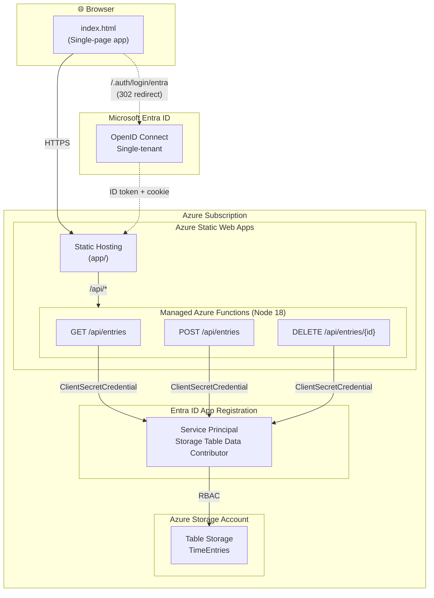

# Time Entry Demo

A lightweight time-tracking web app built on Azure Static Web Apps with Azure Table Storage for persistence and Entra ID for authentication.


## What You Get

- **Single-page time entry UI** — date, project, task, hours, billable flag, notes
- **Persistent storage** — Azure Table Storage (no SQL database needed)
- **Entra ID authentication** — locked to your Azure AD tenant
- **Serverless API** — Azure Functions (managed by Static Web Apps)
- **Zero infrastructure to manage** — all serverless, free tier eligible

## Architecture



### How it works

| Layer | Details |
|-------|---------|
| **Front-end** | Single HTML file served by SWA's global CDN. No build step. |
| **Authentication** | SWA's built-in auth with a custom OpenID Connect provider (Entra ID, single-tenant). Unauthenticated users are redirected to `/.auth/login/entra`. |
| **API** | Three Azure Functions (managed by SWA, Node 18). Routed automatically via `/api/*`. |
| **Storage auth** | A service principal with the **Storage Table Data Contributor** RBAC role authenticates via `ClientSecretCredential`. Credentials are stored as SWA app settings (encrypted at rest). |
| **Data** | Azure Table Storage — schema-less, pay-per-use, no database server to manage. |

## Prerequisites

| Tool | Minimum Version | Install |
|------|----------------|---------|
| **PowerShell** | 7+ | Built into Windows 11, or [install](https://learn.microsoft.com/en-us/powershell/scripting/install/installing-powershell) |
| **Azure CLI** | 2.50+ | `winget install Microsoft.AzureCLI` |
| **Node.js** | 18+ | `winget install OpenJS.NodeJS.LTS` |

You also need:
- An Azure subscription (free tier works)
- Permissions to create app registrations in your Entra ID tenant

## Quick Start

```powershell
# 1. Clone this repo
git clone https://github.com/YOUR_USERNAME/time-entry-demo.git
cd time-entry-demo

# 2. Log in to Azure (if not already)
az login

# 3. Deploy everything
./deploy.ps1
```

That's it. The script will:
1. Create a resource group, storage account, and Static Web App
2. Register Entra ID apps (one for auth, one for Table Storage access)
3. Configure all app settings
4. Deploy the app and API

At the end it prints the URL to open in your browser.

## Options

```powershell
# Deploy with a custom prefix (affects resource names)
./deploy.ps1 -Prefix myteam

# Deploy to a different region
./deploy.ps1 -Location westus2

# Deploy without Entra ID auth (open to anyone)
./deploy.ps1 -SkipAuth

# Tear down everything
./deploy.ps1 -Teardown
./deploy.ps1 -Prefix myteam -Teardown   # if you used a custom prefix
```

## Project Structure

```
time-entry-demo/
├── deploy.ps1                    # One-click deployment script
├── app/
│   ├── index.html                # Single-file front-end (HTML + CSS + JS)
│   └── staticwebapp.config.json  # Generated by deploy.ps1
└── api/
    ├── host.json                 # Azure Functions host config
    ├── package.json              # Node.js dependencies
    ├── getEntries/               # GET /api/entries
    │   ├── function.json
    │   └── index.js
    ├── saveEntry/                # POST /api/entries
    │   ├── function.json
    │   └── index.js
    └── deleteEntry/              # DELETE /api/entries/{id}
        ├── function.json
        └── index.js
```

## Cost

All resources are free-tier eligible:
- **Static Web Apps**: Free tier (100 GB bandwidth/month)
- **Azure Table Storage**: ~$0.045/GB/month (pennies for demo usage)
- **Azure Functions**: Managed by SWA, included in free tier

> **Tip:** If you upgrade the SWA to Standard ($9/month) for features like custom domains or higher limits, managed identity becomes available for the SWA resource — but note that SWA managed functions **cannot** use the identity at runtime (the `IDENTITY_HEADER` is not exposed to function code). A linked Azure Functions app would be needed for full MI support.

## Troubleshooting

### "Too many redirects" after deploying
The `/.auth/*` route must appear **before** the `/*` catch-all in `staticwebapp.config.json`. Without it, unauthenticated requests to `/.auth/login/entra` match the `/*` rule (which requires `authenticated`), triggering a 302 back to `/.auth/login/entra` — an infinite loop. The deploy script handles this automatically.

### "Could not load entries" or API returns 500
| Cause | Fix |
|-------|-----|
| **Storage account has public access disabled** | Enable public network access. SWA managed functions don't support private endpoints on storage. |
| **TimeEntries table doesn't exist** | Re-run `deploy.ps1` — it creates the table via ARM at deploy time. |
| **Missing app settings** | Check `AZURE_TENANT_ID`, `AZURE_CLIENT_ID`, `AZURE_CLIENT_SECRET`, and `TABLE_STORAGE_URL` are set on the SWA. |
| **Service principal secret expired** | Re-run `deploy.ps1` — it appends a fresh 1-year credential. |

### Checking API logs
```powershell
# Stream live logs from the SWA
az staticwebapp functions show --name timeentry-demo --resource-group rg-timeentry-demo
```

## Security Notes

- **Service principal authentication**: The API uses `ClientSecretCredential` (tenant ID + client ID + secret) to access Table Storage. The deploy script stores these as SWA app settings (encrypted at rest).
- **Why not managed identity?** SWA managed functions do not expose `IDENTITY_HEADER` or the MSI endpoint to user code. `DefaultAzureCredential` fails entirely. This is a [known platform limitation](https://learn.microsoft.com/en-us/azure/static-web-apps/apis-functions).
- **Storage network access**: The storage account uses public network access. To fully lock it down, you'd need to replace SWA managed functions with a linked Azure Functions app that supports VNet integration and private endpoints.

## Cleanup

To remove all Azure resources:

```powershell
./deploy.ps1 -Teardown
```

This deletes the resource group (and everything in it) plus the Entra ID app registrations.
