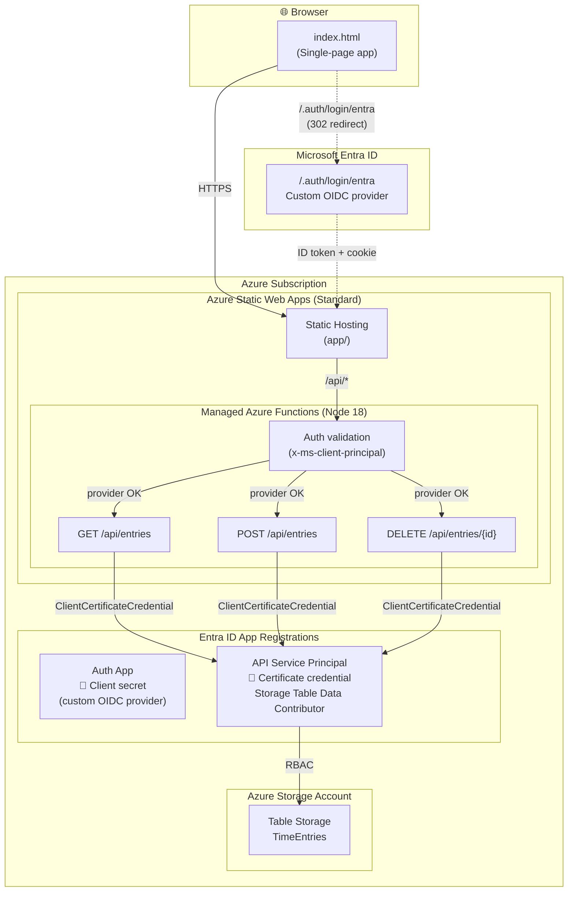

# Time Entry Demo

A lightweight time-tracking web app built on Azure Static Web Apps with Azure Table Storage for persistence and Entra ID for authentication.


## What You Get

- **Single-page time entry UI** — date, project, task, hours, billable flag, notes
- **Persistent storage** — Azure Table Storage (no SQL database needed)
- **Azure AD authentication** — custom OIDC provider with single-tenant Entra ID
- **Serverless API** — Azure Functions (managed by Static Web Apps)
- **Zero infrastructure to manage** — all serverless, minimal cost

## Architecture



### How it works

| Layer | Details |
|-------|---------|
| **Front-end** | Single HTML file served by SWA's global CDN. No build step. |
| **Authentication** | Custom OIDC provider (`/.auth/login/entra`) backed by a single-tenant Entra ID app registration. The deploy script creates the app, client secret (via Graph API), and configures optional claims automatically. |
| **Auth validation** | Each API function checks the `x-ms-client-principal` header to confirm the user authenticated via the custom OIDC provider (defense in depth). Since the provider is configured with a single-tenant issuer URL, only users from the expected tenant can obtain a valid session. |
| **API** | Three Azure Functions (managed by SWA, Node 18). Routed automatically via `/api/*`. |
| **Storage auth** | A service principal with the **Storage Table Data Contributor** RBAC role authenticates via `ClientCertificateCredential`. The deploy script generates a self-signed certificate — no password credentials needed (compliant with enterprise Entra policies). |
| **Data** | Azure Table Storage — schema-less, pay-per-use, no database server to manage. |

## Prerequisites

| Tool | Minimum Version | Install |
|------|----------------|---------|
| **Windows** | 10 or 11 | Required (uses `New-SelfSignedCertificate` for cert generation) |
| **PowerShell** | 7+ | Built into Windows 11, or [install](https://learn.microsoft.com/en-us/powershell/scripting/install/installing-powershell) |
| **Azure CLI** | 2.50+ | `winget install Microsoft.AzureCLI` |
| **Node.js** | 18+ | `winget install OpenJS.NodeJS.LTS` |

You also need:
- An Azure subscription
- Permissions to create app registrations in your Entra ID tenant

## Quick Start

```powershell
# 1. Clone this repo
git clone https://github.com/t3blake/time-track-demo.git
cd time-track-demo

# 2. Log in to Azure (if not already)
az login

# 3. Deploy everything (you'll be prompted for a unique prefix)
./deploy.ps1
```

The script prompts for a **prefix** (e.g. your alias) to generate unique Azure resource names. Then it will:
1. Create a resource group, storage account, and Static Web App (Standard tier)
2. Create a service principal with a certificate credential for Table Storage access
3. Register an Entra ID auth app with client secret, API permissions, and optional claims
4. Generate the SWA config with custom OIDC auth routes
5. Configure all app settings and deploy the app + API

At the end it prints the URL to open in your browser.

## Options

```powershell
# Skip the prefix prompt by passing it directly
./deploy.ps1 -Prefix jsmith

# Deploy to a different region
./deploy.ps1 -Prefix jsmith -Location westus2

# Deploy without Entra ID auth (open to anyone)
./deploy.ps1 -Prefix jsmith -SkipAuth

# Tear down everything
./deploy.ps1 -Prefix jsmith -Teardown
```

## Project Structure

```
time-entry-demo/
├── deploy.ps1                    # One-click deployment script
├── app/
│   ├── index.html                # Single-file front-end (HTML + CSS + JS)
│   └── staticwebapp.config.json  # Generated by deploy.ps1
└── api/
    ├── host.json                 # Azure Functions host config
    ├── package.json              # Node.js dependencies
    ├── getEntries/               # GET /api/entries
    │   ├── function.json
    │   └── index.js
    ├── saveEntry/                # POST /api/entries
    │   ├── function.json
    │   └── index.js
    └── deleteEntry/              # DELETE /api/entries/{id}
        ├── function.json
        └── index.js
```

## Cost

| Resource | Tier | Approximate cost |
|----------|------|------------------|
| **Static Web Apps** | Standard | ~$9/month |
| **Azure Table Storage** | Standard LRS | ~$0.045/GB/month (pennies for demo usage) |
| **Azure Functions** | Managed by SWA | Included with SWA tier |

The deploy script creates a **Standard** tier SWA (~$9/month). Standard is required in environments with restrictive Entra ID policies and also enables features like custom domains and higher bandwidth limits.

> **Note on managed identity:** Standard tier enables managed identity on the SWA resource, but SWA managed functions **cannot** use it at runtime (`IDENTITY_HEADER` is not exposed to function code). The API uses a service principal instead. A linked Azure Functions app would be needed for full MI support.

## Troubleshooting

### "Too many redirects" after deploying
The `/.auth/*` route must appear **before** the `/*` catch-all in `staticwebapp.config.json`. Without it, unauthenticated requests to `/.auth/login/entra` match the `/*` rule (which requires `authenticated`), triggering a 302 back to `/.auth/login/entra` — an infinite loop. The deploy script handles this automatically.

### "Could not load entries" or API returns 500
| Cause | Fix |
|-------|-----|
| **Storage account has public access disabled** | Enable public network access. SWA managed functions don't support private endpoints on storage. |
| **TimeEntries table doesn't exist** | Re-run `deploy.ps1` — it creates the table via ARM at deploy time. |
| **Missing app settings** | Check `AZURE_TENANT_ID`, `AZURE_CLIENT_ID`, `AZURE_CLIENT_CERTIFICATE`, `TABLE_STORAGE_URL`, `ENTRA_CLIENT_ID`, and `ENTRA_CLIENT_SECRET` are set on the SWA. |
| **Service principal certificate expired** | Re-run `deploy.ps1` — it generates a fresh 1-year certificate. |

### Checking API logs
```powershell
# Stream live logs from the SWA (replace <prefix> with your prefix)
az staticwebapp functions show --name <prefix>-demo --resource-group rg-<prefix>-demo
```

## Security Notes

- **Custom OIDC authentication**: Uses a custom OpenID Connect provider (`/.auth/login/entra`) backed by a single-tenant Entra ID app registration. The deploy script creates the app registration, client secret (via Graph API to bypass policies that block `az ad app credential reset`), API permissions, and optional claims automatically.
- **Optional claims**: The auth app is configured with optional ID token claims (`email`, `preferred_username`, `upn`) to ensure SWA can identify the user. Without these, SWA returns a 403 `invalidUserInfo` or enters a redirect loop.
- **API-level auth validation**: For defense in depth, every API function checks that the `x-ms-client-principal` header confirms the user authenticated via the custom OIDC provider (`identityProvider === "entra"`). Since the provider is configured with a single-tenant issuer URL, only users from the expected tenant can obtain a valid session. Note: Custom OIDC providers on SWA do not populate claims in the `x-ms-client-principal` header sent to API functions, so claim-based checks are not possible.
- **Certificate-based storage auth**: The API uses `ClientCertificateCredential` with a deploy-time generated self-signed certificate (1-year expiry). The PEM is stored as a base64-encoded app setting (encrypted at rest). No password credentials are created for the API service principal.
- **Why not managed identity?** SWA managed functions do not expose `IDENTITY_HEADER` or the MSI endpoint to user code. `DefaultAzureCredential` fails entirely. This is a [known platform limitation](https://learn.microsoft.com/en-us/azure/static-web-apps/apis-functions).
- **Storage network access**: The storage account uses public network access. To fully lock it down, you'd need to replace SWA managed functions with a linked Azure Functions app that supports VNet integration and private endpoints.

## Cleanup

To remove all Azure resources:

```powershell
./deploy.ps1 -Prefix jsmith -Teardown
```

This deletes the resource group (and everything in it) plus all Entra ID app registrations.
Use the same `-Prefix` you used when deploying.
